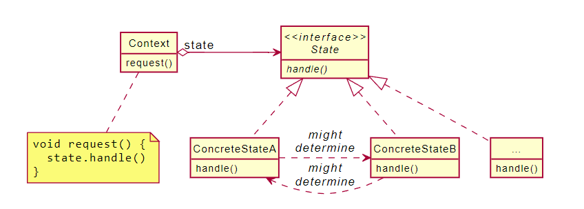

# Design Patterns

<em>**source**</em>
- https://elqoo.thinkific.com/courses/take/design-patterns-in-java
- https://www.coursera.org/learn/design-patterns
- https://ocw.mit.edu/courses/electrical-engineering-and-computer-science/6-170-laboratory-in-software-engineering-fall-2005/

## Contents
- [Creational Patterns](#creational-patterns)
    - [Singleton](#singleton) 
    - [Builder](#builder)
    - [Factory Object](#factory-object)
    - [Abstract Factory](#abstract-factory)
    - [Factory Method](#factory-method)
    - [Prototype](#prototype)
        - [Factory vs Prototype](#factory-vs-prototype)
- [Structural Patterns](#structural-patterns)
    - [Facade](#facade)
    - [Adapter](#adapter)
    - [Composite](#composite)
    - [Proxy](#proxy)
    - [Decorator](#decorator)
        - [Decorator vs Composite](#decorator-vs-composite)
- [Behavioral Patterns](#behavioral-patterns)
    - [Template Method](#template-method)
    - [Chain of Responsibility](#chain-of-responsibility)
    - [State](#state)
    - [Strategy](#strategy)

 

## Creational Patterns
### Singleton
##### Keys
- One instance + one access point.
- Encapsulate the constructor. Only allow accessing through getInstance method.
- Use a variable to validate uniqueness of the instance.
- Prevent creating new instances, hence prevent conflict and make it consistent.

##### When
- Only one instance of class required.
- Must be one access point.
- Need to manage object instances
- e.g. FileSystem, Window Manager

##### Benefits
- Controlled access to one instance.
- Reduce name space (Avoids global variables).
- The ability to subclass the singleton class.
- Can configure the number of instances.
- lazy constructor: the object is not created until it's needed.

##### Drawbacks
- State of the singleton must be shareable between program executions.

### Builder

##### Keys
- 'Separate the construction' of a complex object from its representation so that the same construction process can create different representations
- **One build process** for multiple similar objects
- **Advance control** over the build process.

##### When
- Separate construction with internal representation.
- One process have multiple object representation (or various implementation)
- need to assemble objects
- e.g. query construction to use with many databases

##### Implementation
- have object and builder interface.
- each can have various implementation.
1. Client creates a concreteBuilder.
2. Client creates a new director and pass concreteBuilder to the director.
3. Director constructs the objects by buildPart().
4. Client asks the result from concreteObject that got built.

##### Benefits
- Uniform production creation via an interface.
- Abstract building process.
- Loose coupling (separate construction from representation).
- Finer control on the build process -> Allow multiple steps or assemble objects more easily.

### Factory Object (not gang of four's)
##### Keys
- Factory could create various type of object without changing Client code.
- coding to interface, not implementation.

##### Benefits
- Clients can instantiate the same set of classes.
- Cut out redundant code and made the software easier.

### Abstract Factory
- Just add an abstract layer atop of Factory Object, so it could have subclasses.

### Factory Method
##### Keys
- Define an interface for creating objects, but let subclasses decide which class to instantiate.
- Virtual Constructor: Factory Method lets a class defer instantiation to subclasses.
- Instead of creating a new instance, using Factory method able us to generalize the class, hence 'coding to interface, not implementation'

##### When
- Class can't expect the type of object it must create.
- Subclasses must decide what types of objects are to be created.

##### Benefits
- Delegate object creation until runtime.
- Hooks for subclasses.
- Base class can provide a 'default implementation'.

### Prototype
##### Keys
- Specify the kinds of objects to create using a prototypical instance, and create new
objects by copying this prototype.
- Configure object creation by cloning.
- Avoid building a class hierarchy of factories that parallels the class hierarchy
  of products.
  
##### When
- Classes to instantiate are specific at run time.
- Avoid building class hierarchies.
- A class can have multiple instances of state.
  
##### Benefits
- Add/remove products at runtime.
- Reduce subclassing.
- Configure application dynamically.
- Different values for new objects.

##### Drawbacks
- Require creating prototypes before other object creation.

###### <em>Factory vs Prototype</em>
>Factory pattern is used to introduce loose coupling between objects as the factory will take care of all the instantiation logic hiding it from the clients.
>- Return a new instance of the type we are interested
>- Factory Method creation is carried away through inheritance
>- Factory patterns create objects based on a well-defined class hierarchy. The caller can pass in arguments, and the factories use them to determine which objects to create.
>- Factory method is used to delegate the responsibility of choosing which implementation or subclass you want to use like Car interface can be implemented by SportsCar and EconomicalCar and based upon budget factory will return appropriate object.
>
>Prototype pattern on the other hand, is used when the cost of creating an object is expensive, and it's ok to copy an existing instance than creating a new instance.
>- Return an instance of itself with clone method
>- Prototype creation through delegation i.e Polymorphism
>- Prototype pattern adds an extra layer of abstraction on top of the object creation process, objects are created (or cloned) based on runtime objects not just based on a class hierarchy.
>- Prototype is used in scenarios where construction of the object is a costly affair. It could be in terms of memory or computation for example, you have complex objects like Trade so, you can create a basic default object and on runtime can just clone it and do some changes as per requirement.
>
>An Abstract Factory can use prototypes under the hood to increase its flexibility in providing instances of different classes.

## <a name="#structural-patterns"><a>Structural Patterns
### Facade
##### Keys
- A facade simply acts as a point of entry into your subsystem and does not add more functionality to the subsystem.
    - Wrapper class allow Client class to interact through the Facade.
    - Hide the complexity of a subsystem by encapsulating it behind a unifying wrapper called a facade class.
- Abstract complex from client classes.
    - Remove the need for client classes to manage a subsystem on their own. (
    - Less coupling between subsystem & client classes.
    - Prevent all client classes from seeing the account objects and how these accounts behave.
- Handles instantiation and redirection of tasks to the appropriate class within the system.

##### Benefits
- Subsystem is easier to use.
    - Client don't require specific knowledge.
- Loose coupling.
- Subsystem can still be used directly (if necessary).

##### Drawbacks
- Facade introduces an extra programming layer.

### Adapter

##### Keys
- Adapters change the interface of a class without changing its basic functionality.
- Providing a compatible interface to help facilitate communication between two existing systems.
- The Adapter wrap the Adaptee and expose a target interface to the client.
- The Adapter indirectly change the Adaptee's interface into one that the client is expecting by implementing a target interface.
- The Adapter indirectly translates the Client's request into a request that the Adaptee class is expecting.
- The Adapter reuses an existing Adaptee with an incompatible interface.

##### When
- The Client and Adaptee classes have incompatible interfaces.
- The Adaptee might be third-party library which we can't change its interface, so we use Adapter.

##### Participants
- A client class. This class is the part of your system that wants to use a third-party library or external systems.
- An adaptee class. This class is the third-party library or external system that is to be used.
- An adapter class. This class sits between the client and the adaptee. The adapter conforms to what the client is expecting to see, by implementing a target interface. The adapter also translates the client request into a message that the adaptee will understand, and returns the translated request to the adaptee. The adapter is a kind of wrapper class.
- A target interface. This is used by the client to send a request to the adapter.

##### Implementation
1. Design the target interface.
2. Implement the target interface with the Adapter class.
3. Send the request from the Client to the Adapter using the target interface.

##### Benefits
- Adapter can override Adaptee behaviors (it is a subclass).
- One Adapter can use many Adaptees.

##### Drawbacks
- Doesn't work for a class with many subclasses (can't extend them all).

### Composite

##### Keys
- Compose objects into tree structures.
- Represent part-whole hierarchies of objects.
- Enforcing polymorphism across each class through implementing an interface (or inheriting from a superclass).
- Use Recursive composition: A composite object can contain other composite objects since it's a subtype of component.
- Decomposition + generalization: They break a whole into parts, but have the whole and parts both conform to a common type.

##### When
- Want to use individual type of objects to build a tree-like structure.
- Treats individual of objects uniformly without checking their types.
- Ignore differences between compositions and individual items.

##### Implementation
1. Design the interface that defines the overall type.
2. Implement the composite class.
3. Implement the leaf class.

##### Benefits
- Define class hierarchies of consistent objects.
- Client is simplified 
    - Abstraction from the client.
    - No distinction between child and composite objects.
- Easy to add new components.

##### Drawbacks
- Can be hard for new components with different expectations.

### Proxy
##### Keys
- Use proxy class to wrap the real subject class to have a polymorphic design, so the client class can expect the same interface for the proxy and real subject classes.
- Use a lightweight proxy in place of a resource intensive object until it's actually needed. act as a lighter version of the real subject class (supposes to be lighter. so not all request is delegated).
- Control access to the real subject class. 
    - Implement some form of intelligent verification of request from client code.
    - Determine if, how, and to whom the request should be forwarded to. 
- Present a local representation of a system that is not in the same physical or virtual space.
- Acts as a simplified, or lightweight version, of the original object.

##### When
- Act as a protection proxy; The real subject class may contains sensitive information.
- Act as a wrapper virtual proxy; The real subject class is resource intensive to instantiate.
- Act as a remote proxy; proxy class is local, while the real subject class exist remotely.
- Require extra functionality. 

##### Implementation
1. Design the subject interface.
2. Implement the real subject class.
3. Implement the proxy class.

##### Benefits
- Defer creating resource intensive object until needed.
- Control access to specific object.
- Act as a local representation for a remote system.

### Decorator

##### Keys
- A flexible alternative to subclassing for extending functionality.
- Decorator aggregates other types of components, which wil allow us to 'stack' components on top of each other.
- Each decorator object in the stack is aggregated in a 1-1 relationship with the object below it in the stack.
- Decorator serves as the abstract superclass of concrete decorator classes that will each provide an increment of behavior.
- By combining aggregation and polymorphism, we can recursively invoke the same behavior execute upwards from the concrete component object. 

<em>example</em>

    
<em>Example</em>

    

    
###### Aggregation
- Let us create stack of objects.
- Aggregation is used to represent a 'has a' or weak containment relationship between 2 objects.
- Aggregation stacks: each level builds a stack of objects, that know about its behavior and augmented one underneath it.
- The Aggregation relationship is always 1-1 in decorator design pattern.
- Makes use of both interfaces and inheritance.

###### Decorator vs Composite
- Decorator is more like a stack of objects, where Composite is a tree.

##### When
- Add functionality to objects, without affecting other objects.
- Functionalities can be taken away in the future.
- Extension by subclassing is difficult (need to duplicate a lot of code).

##### Implementation
1. Design the component interface.
2. Implement the interface with your base concrete component class.
3. Implement the interface with your abstract class decorator.
4. Inherit from the abstract decorator and implement the component interface with concrete decorator classes.

##### Benefits
- More flexible than inheritance.
- Allow objects to dynamically add behaviors to others at runtime.
    - use aggregation as a substitute for pure inheritance.
    - implement functionality when you need it, where you need it in the class hierarchy.    
- Reduce the number of classes needed to be created (better than inheritance).

##### Drawbacks
- Object identity cannot be used with decorators.
    - A decorator acts as a transparent enclosure, but a decorated component is not identical to the component itself. 
- Too many small decorator objects might cost performance problem.

## Behavioral Patterns
### Template Method
##### Keys
- Defining a skeleton.
- Deferring some implementation steps to subclasses.
- Generalization + Inheritance.

##### When
- Have two classes (or more) with similar functionalities.
    - Can generalize two classes into a new superclass.
    - it's simple and can be used most of the time.

##### Implementation
- Template Class
    - Must be an abstract class.
    - Has a template method that has several steps, could be final (i.e. driveToDestination).
    - The steps which will be defined by the subclasses (i.e. accelerate, steer, and brake of SelfDrivingVehicle template) are defined abstractly.
    - If some steps are common to all the subclasses, it can be defined as a private method in the abstract superclass.
    - It's important for template methods to specify which operations are hooks (may
      be overridden) and which are abstract operations (must be overridden).
    - A hook operation (in abstract base class) often does nothing by default.
    
##### Benefits
- Provide hooks.
- Avoid code duplication.

### Chain of Responsibility
##### Keys
- A chain of objects that responsible for handling request (i.e. Express.js middleware callback handler).

##### Implementation
1. Check if rule matches.
2. if it matches, do something specific.
3. if it doesn't match, call the next filter in the list.
- Can use Template Pattern to ensure that each class will handle each class in a similar way, following the required steps.

##### Benefits
- Reduce coupling.
    - Avoid coupling the sender to the receiver by giving more than one object the chance to handle the request. 
    - The sender has no explicit knowledge of each other, and an object in the chain doesn't have to know about the chain's structure.

##### Drawbacks
- Receipt isn't guaranteed.
    -Since a request has no explicit receiver, there's no guarantee it'll be handled.
    - the request can fall off the end of the chain without ever being handled. 
    - A request can also go unhandled when the chain is not configured properly.
    - if the rule doesn't match in a filter, but forgot to pass the request to the next filter then the handling end prematurely.
    
### State

##### Keys
- When state changes, the behavior can be altered.
- Have an object for each state.
    - When state changes, simply change the state object.
    - Avoid complex if-else-structures.
- Only context is available for clients to see!
- state pattern != state machine
      
##### When
- Need to change behavior of an object based upon the state it is in at runtime.

##### Benefits
- State related behavior is centralized
- Avoid complex if-else-structures
    - When state changes, simply change the state object.
    - Implementation is done in the state object.

### Strategy
##### Keys
- Encapsulate algorithms. 